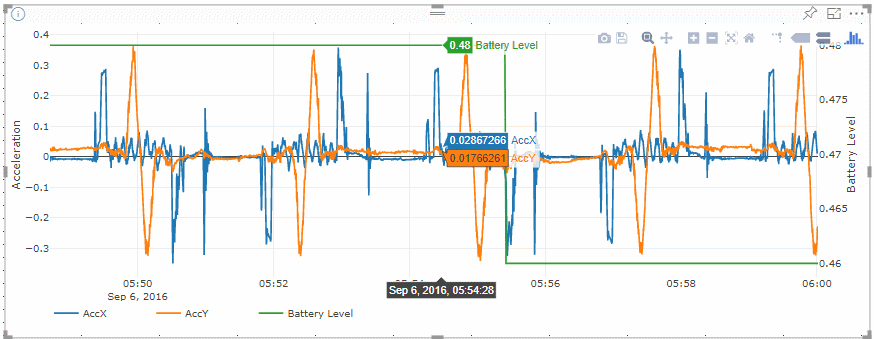

# powerbi-plotlyscatterchart
Scatter Chart Custom Visual for PowerBI implemented using plotly.js

# Features
Using outstanding plotly scatter chart within PowerBI
- Zoomable
- Popups showing exact value
- Second Y-Axis
- Split data into multiple traces

Data is always sampled to max 10000 records (see dataReductionAlgorithm in capabilities.json). Like this it's possible to see an overview of bigger datasets.

Screenshots:

# Build
Precondition: npm, typings and pbiviz are installed.

1. typings install
2. pbiviz update
3. Create customized lodash build in ./external:
-- install lodash-cli: npm i -g lodash-cli
-- lodash category=array,collection,object,lang -o external\lodash.custom.js
4. Download plotly-basic.min javascript library into directory ./external from the following URL: https://cdn.plot.ly/plotly-basic-latest.min.js
5. Create custom visual file: pbiviz package
6. Use ./dist/plotlyscatter.pbiviz in PowerBI Desktop and Online
